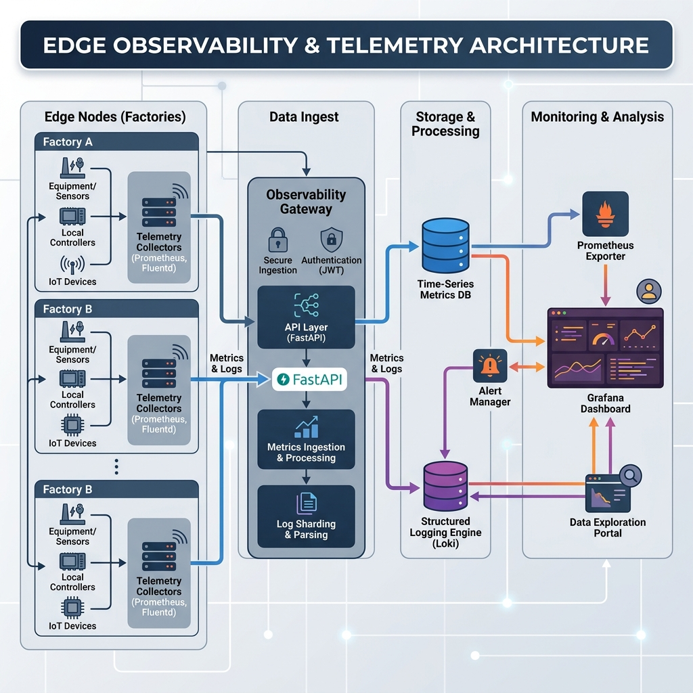
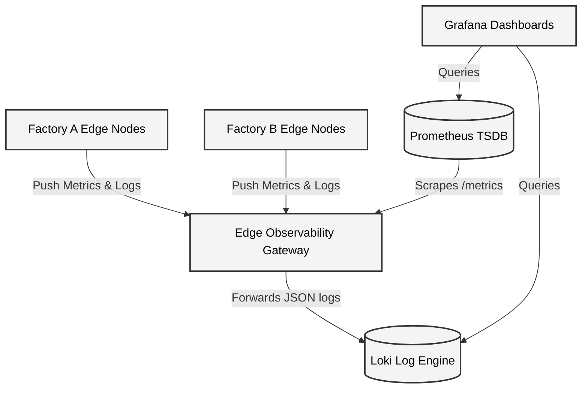

<div align="center">
  
</div>

<h1 align="center">Edge Observability & Telemetry</h1>

<p align="center">
  <strong>The Central Telemetry Gateway for the Edge AI Ecosystem</strong>
</p>

---

## 1. Executive Summary

**Edge Observability** is a high-throughput, low-latency FastAPI gateway. Because physical Edge Nodes (factory cameras, local servers) are often shielded by strict inbound firewalls, standard Prometheus scraping (pull-model) fails. 

This repository solves that by providing a highly available **push-gateway**. Edge Nodes push their system metrics, AI inference latencies, and structured logs here. This gateway then aggregates and securely exposes them for downstream Time-Series Databases (like Prometheus) and Log Engines (like Loki) to consume.

👉 **[View the Detailed HLD, LLD, and Telemetry Flows in the Documentation](docs/architecture.md)**

---

## 2. High-Level Architecture (HLD)

<div align="center">
  
</div>



---

## 3. Core Capabilities

### 3.1 Ingest System & Inference Metrics
Edge nodes blast their current CPU, RAM, and Model Inference speeds to the gateway.
```bash
curl -X POST http://localhost:8002/api/v1/telemetry/metrics \
  -H "Content-Type: application/json" \
  -d '{
    "node_id": "factory-cam-01",
    "factory_location": "detroit-a",
    "system_metrics": {
      "cpu_usage_percent": 45.5,
      "ram_usage_bytes": 1024000,
      "disk_usage_bytes": 500000
    },
    "inference_metrics": [
      {
        "model_name": "defect-detection-v2",
        "inference_count": 1,
        "latency_ms": 150.5,
        "success": true
      }
    ]
  }'
```

### 3.2 Prometheus Exporter
Standard Prometheus engines can scrape the aggregated state of the entire global edge fleet perfectly using this endpoint.
```bash
curl http://localhost:8002/metrics
```

### 3.3 Structured Log Ingestion
Edge nodes push `structlog` formatted JSON logs to the gateway for central sharding and indexing.
```bash
curl -X POST http://localhost:8002/api/v1/telemetry/logs \
  -H "Content-Type: application/json" \
  -d '{
    "node_id": "factory-cam-02",
    "level": "ERROR",
    "message": "Thermal runaway detected",
    "context": {
      "temperature_celsius": 85.0
    }
  }'
```

---

## 4. Deployment

Spin up the Observability Gateway alongside a simulated Prometheus and Grafana stack:
```bash
docker-compose up -d --build
```
