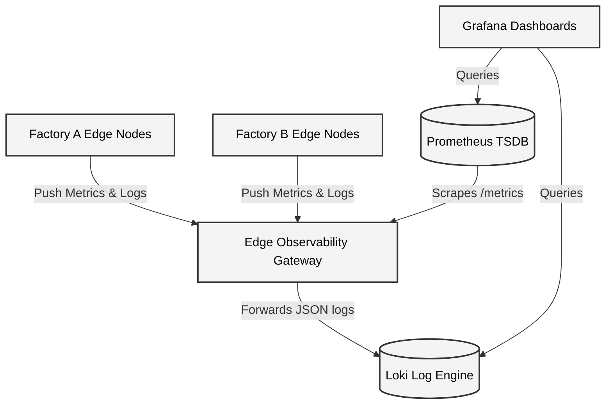
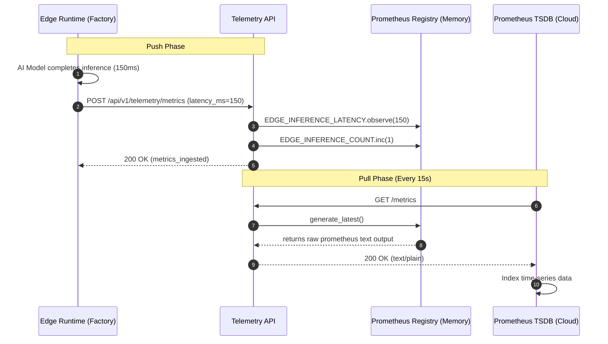

# Edge Observability Architecture

Because physical edge factories reside behind strict corporate firewalls, central cloud monitoring systems (like Prometheus) cannot initiate inbound TCP connections to scrape metrics. 

To bypass this, we use the **Edge Observability Gateway** as an inverted proxy. The Edge Nodes act as clients, establishing outbound connections to *push* data to this Gateway. The Gateway then holds this state in a centralized `prometheus_client` registry, which the cloud Prometheus TSDB can seamlessly scrape.

---

## High-Level Design (HLD)

### HLD Component Details
1. **Edge Observability Gateway (FastAPI)**: The highly-available API layer that absorbs tens of thousands of metric payloads per second from edge nodes.
2. **Prometheus TSDB**: Periodically pulls the aggregated metrics from the Gateway.
3. **Grafana Dashboards**: Provides visual charts and alerting mechanics to the DevopsTrio network operations center (NOC).

---

## Low-Level Design (LLD) - Metrics Execution Flow

This sequence diagram details the precise execution path when an AI Model finishes an inference on the edge and reports its latency back to the central cloud.

